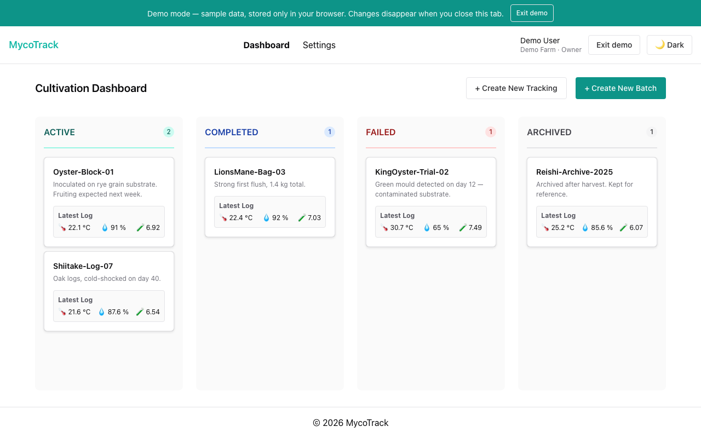
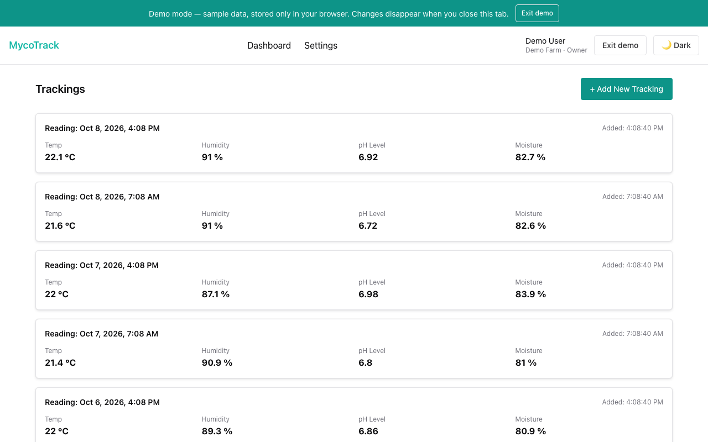
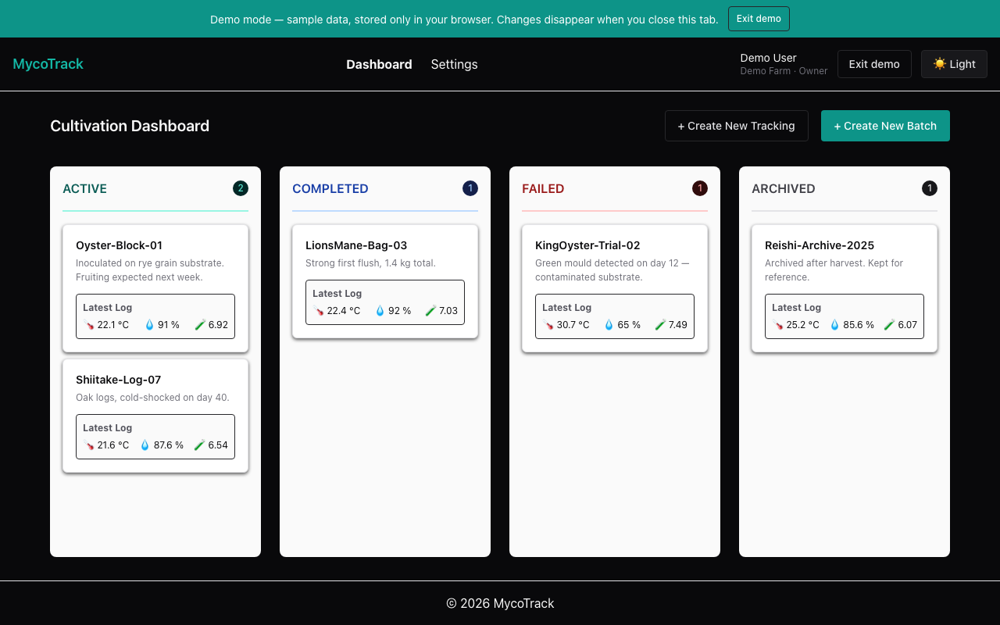
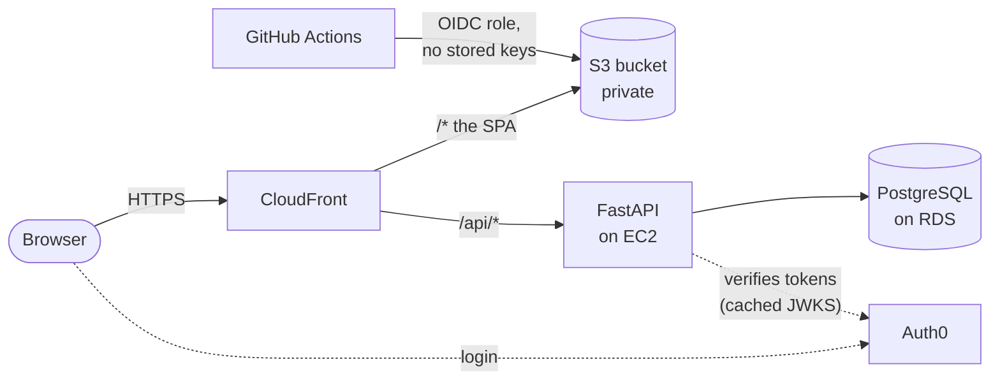
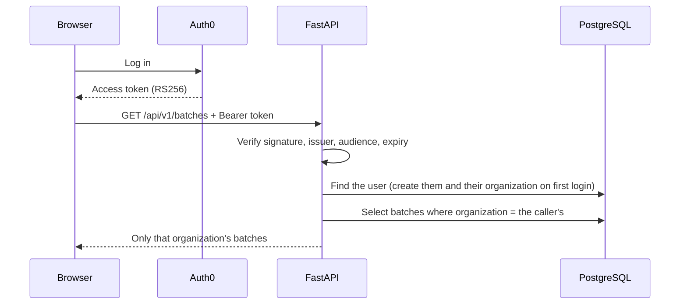
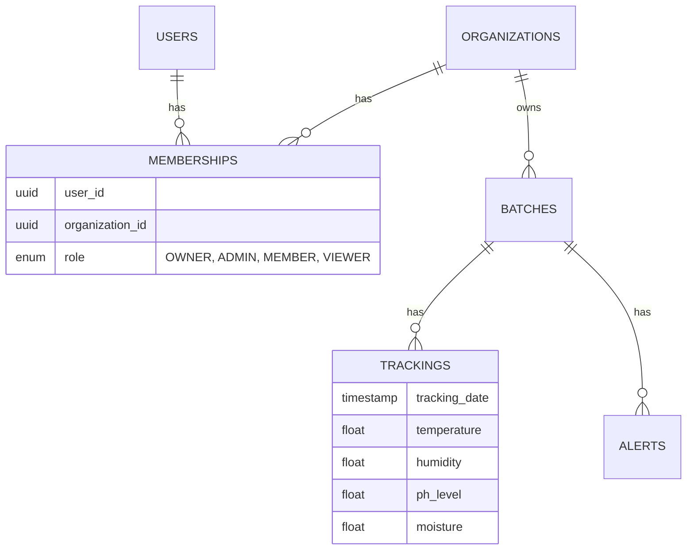

# 🍄 MycoTrack

[](https://github.com/belennG/mycotrack/actions/workflows/backend-ci.yml)
[](https://github.com/belennG/mycotrack/actions/workflows/frontend-ci.yml)
[](https://github.com/belennG/mycotrack/actions/workflows/frontend-deploy.yml)

**Environmental monitoring for mushroom cultivation.** Growers record temperature, humidity, pH and moisture readings for each cultivation batch and follow every batch from inoculation to harvest.

A full-stack project, built to production standards: multi-tenant, authenticated, tested at three levels, and deployed to AWS with infrastructure as code.

### 👉 [**Try the live demo**](https://d2ctgb9agyhek5.cloudfront.net)

Click **Try the demo**: no account needed. It runs on sample data that lives only in your browser and disappears when you close the tab.



| | |
| --- | --- |
|  |  |
| Several readings per day, each with its own time, newest first | Dark mode |

## What it does

- **Batches** move through a lifecycle (active, completed, failed, archived) and are laid out on a board by status, each card showing its latest reading.
- **Readings** record temperature, humidity, pH and moisture with a **date and time**, are validated against physical ranges, and are paged through ten at a time.
- **Organizations and roles.** Data belongs to an organization; members are `OWNER`, `ADMIN`, `MEMBER` or `VIEWER`, and nobody can see or touch another organization's data.
- **Sign in with Auth0**, or **try the demo** without an account.
- **Analytics and alerts API**: averages, trends, completeness and threshold alerts per batch. (The UI for these is not built yet.)

## How it fits together



One HTTPS address serves both the app and the API, so there is no CORS to configure, and the free CloudFront certificate is what makes Auth0 login possible without owning a domain.





## Tech stack

| | |
| --- | --- |
| **Frontend** | React 19, TypeScript, Vite, Chakra UI 3, TanStack Query, React Router, React Hook Form + Zod, Axios |
| **Backend** | Python 3.13, FastAPI, SQLAlchemy 2, Alembic, Pydantic 2, PostgreSQL |
| **Auth** | Auth0 (OIDC, RS256 access tokens validated against the tenant's JWKS) |
| **Infrastructure** | AWS: CloudFront, S3, EC2, RDS. Terraform. GitHub Actions deploys with OIDC, no stored AWS keys |
| **Quality** | Vitest, Testing Library, MSW, Playwright, pytest · Black, Flake8, mypy, Bandit · Oxlint, Prettier · pre-commit hooks · Sentry |

## Engineering decisions worth a look

- **Tenant isolation is enforced in one place and tested hard.** Every route resolves the caller's organization and role (`backend/auth/tenancy.py`); anything in another organization is a **404, not a 403**, so the API never reveals that it exists. Isolation is tested for every resource and operation the API offers, and the migration that introduced it was run against real Postgres with production-shaped data. → [docs/tenancy.md](docs/tenancy.md)
- **Auth0 handles identity only.** Authorization and tenancy live in the application's own database, so the identity provider stays replaceable. First login creates the user and their organization in one transaction, and eight simultaneous first logins against real PostgreSQL produced exactly one of each.
- **A demo that is the real app.** Demo mode swaps the Axios adapter for an in-browser mock of the API, so every screen, hook and form runs for real with no backend or account. It is also what the end-to-end tests run against, which makes them fast and deterministic.
- **One origin, no CORS.** CloudFront serves the SPA from a private bucket and forwards `/api/*` to the API. The single-page-app fallback is a small CloudFront Function on the website behavior only, because a distribution-wide error page would also rewrite genuine 404s from the API. → [infra/README.md](infra/README.md)
- **Keyless deploys.** GitHub Actions assumes an AWS role through OIDC. The role can be assumed only from this repository's `main` branch and can only touch the one bucket.
- **CI catches drift.** `alembic check` fails the build if the models and the migrations disagree. It was added after finding a column that was `DATE` in the database but a date-and-time everywhere else, which had been silently discarding the time of every reading.

## Testing

| Level | What | How |
| --- | --- | --- |
| **Backend** | 45 tests: token validation, first-login provisioning, tenant isolation, roles, time-of-day handling | pytest on an in-memory database |
| **Frontend unit and component** | 119 tests, ~83% line coverage, enforced in CI | Vitest, Testing Library, MSW. Any API call without a mock **fails the test** |
| **End to end** | 29 browser tests: access, dashboard, readings, batches, dark mode | Playwright against the production build |

The tests were written to be able to fail: key behaviors were deliberately broken to confirm the right tests caught them, the unit tests pass on Node 22 and 25 and in three timezones, and they found real bugs, which are fixed. → [frontend/docs/testing.md](frontend/docs/testing.md)

Every pull request runs: formatting, linting, type checks, migrations on a real PostgreSQL (plus a check that they match the models), the backend tests, the frontend unit tests with a coverage floor, the browser tests, and security scans (`npm audit` fails the build at high severity; Bandit and Safety are advisory).

## Run it locally

### The frontend, with the demo (no backend, no account)

```bash
cd frontend
npm ci
npm run dev
```

Open <http://localhost:5173> and click **Try the demo**. Needs Node 22.12 or later.

### The full stack

```bash
# 1. Database
cp backend/.env.example backend/.env       # the defaults match docker-compose.yml
docker compose up -d db

# 2. API
cd backend
python3 -m venv .venv && source .venv/bin/activate
pip install -r requirements.txt
alembic upgrade head
uvicorn main:app --reload                  # http://localhost:8000/docs

# 3. Frontend
cd ../frontend
cp .env.example .env                       # then fill in your Auth0 values
npm run dev
```

If you already have a container named `mycotrack_db`, start it (`docker start mycotrack_db`) instead of the first `docker compose` line, or remove it.

Every `/api/v1` route requires an Auth0 access token, so a real login needs an Auth0 tenant: [docs/auth0.md](docs/auth0.md) walks through it. Without one the API answers `401`, and the demo still works.

### Run the tests

```bash
cd backend && pytest                       # backend
cd frontend && npm test                    # frontend unit tests
cd frontend && npx playwright install chromium && npm run e2e   # browser tests (first time installs the browser)
```

## Project structure

```
backend/        FastAPI app: routers/, models/, schemas/, services/, auth/ (token validation, tenancy),
                alembic/ migrations, tests/
frontend/       React app: src/ (pages, components, hooks, auth/, demo/ mock API), e2e/ Playwright specs
infra/          Terraform: CloudFront distribution, SPA fallback, bucket access, deploy permissions
docs/           Auth0 setup, tenancy design
.github/        CI for backend and frontend, and the frontend deploy workflow
```

## Deployment

- **Frontend:** merging to `main` builds the app and publishes it to S3 behind CloudFront, then invalidates the cache. No AWS keys are stored in the repository.
- **Backend:** a single EC2 instance behind CloudFront. It is updated by hand (pull, `alembic upgrade head`, restart the service).
- **Infrastructure:** CloudFront and its access rules are Terraform. The bucket, EC2 instance, RDS database and the deploy role were created earlier by hand and are referenced, not yet imported.

## Known limitations and what's next

Said plainly, because a reviewer will find them anyway:

- **Teammates can't be invited yet.** Every user owns their own organization, so the `VIEWER`, `MEMBER` and `ADMIN` roles are enforced and tested but not yet reachable from the UI. (#71)
- **Readings can be added but not edited or deleted** in the UI.
- **The analytics and alerts API has no screens yet**, and there is no background alerting or sensor ingestion. (#72, #73)
- **CloudFront talks to the EC2 instance over plain HTTP**, and the API port is still reachable directly. Restricting it to CloudFront is planned.
- **Backend deploys are manual**, and there is no custom domain.
- A real Auth0 login is covered by hand, not by the automated browser tests, which run in demo mode.

---

Built by María Belén Gatti · [LinkedIn](https://www.linkedin.com/in/maria-belen-gatti) · [GitHub](https://github.com/belennG)
